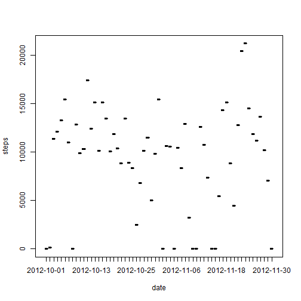
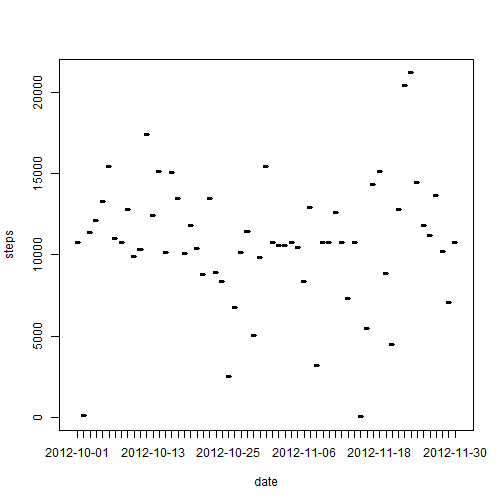
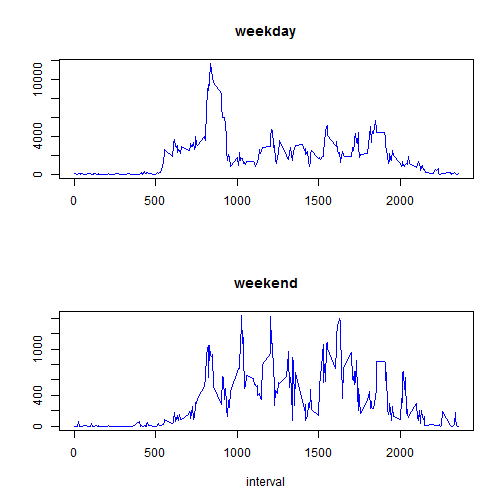

Peer 1
========================================================
  
This file document and execute the analysis over the fitness data provided by Coursera Staff.
  
The file is ditributed in this way:
1. Variables declaration
2. Function declaration
3. Read data
4. Execute analysis
5. Answer the questions

## 1. Variables declaration
Path for data source

```r
data.path <- "../repdata-data-activity/activity.csv"
```

## 2. Function declaration

This function get the number of steps for each day, removing the NA values.
Returns a data.frame with two columns: date and steps.
- $date is the date
- $steps is the total steps sum for this day

```r
get.number.steps.per.day <- function(data) {

  mean.vect <- c()
  median.vect <- c()
  date.vect <- c()
  steps.vect <- c() 
  
  for (date in unique(data$date)) {
    date.vect <- c(date.vect, date)
    steps.vect <- c(steps.vect, sum(data[data$date == date,]$steps, na.rm=T))
  
    mean.vect <- c(mean.vect, mean(data[data$date == date,]$steps, na.rm=T))
    median.vect <- c(median.vect, median(data[data$date == date,]$steps, na.rm=T))
    
  }
  
  df <- data.frame(date=date.vect, steps=steps.vect)
  
  return(df)
  
}
```

this function get the average of the daily activity
Returns a data.frame with two columns: interval and average steps
- $interval is the 5 minutes interval
- $steps is the avg steps for the corresponding interval for all days

```r
get.avg.daily.activity <- function (data) {
  funf.vect <- c()
  funf.sum.vect <- c() 
  
  for (interv in unique(data$interval)) {
    funf.vect <- c(funf.vect, interv)
    funf.sum.vect <- c(funf.sum.vect, sum(data[data$interval == interv,]$steps, na.rm=T))
    
  }
  
  df.interval <- data.frame(interval=funf.vect, steps=funf.sum.vect)
  
  return(df.interval)
}
```

This function read the data and remove the NA values.
The algorithm for removing the NA values is taking the avg of the same interval for the other days

```r
get.data.filled <- function(data.path) {
  dataNoNA <- read.csv(data.path)
  
  nrow(dataNoNA[is.na(dataNoNA$steps),])
  
  for (interva in unique(dataNoNA[is.na(dataNoNA$steps),]$interval)) {
    
    mean.interval <- mean(dataNoNA[dataNoNA$interval == interva,]$steps, na.rm=T)
    
    if (!is.na(mean.interval)) 
      dataNoNA[is.na(dataNoNA$steps) & dataNoNA$interval == interva,]$steps <- mean.interval
    
  }
  
  return(dataNoNA)

}
```
## 3. Read the data source

Read the data source and show a summary

```r
data <- read.csv(data.path)
summary(data)
```

```
##      steps               date          interval   
##  Min.   :  0.0   2012-10-01:  288   Min.   :   0  
##  1st Qu.:  0.0   2012-10-02:  288   1st Qu.: 589  
##  Median :  0.0   2012-10-03:  288   Median :1178  
##  Mean   : 37.4   2012-10-04:  288   Mean   :1178  
##  3rd Qu.: 12.0   2012-10-05:  288   3rd Qu.:1766  
##  Max.   :806.0   2012-10-06:  288   Max.   :2355  
##  NA's   :2304    (Other)   :15840
```

## 4. Execute analysis

### What is mean total number of steps taken per day?

Make a histogram of the total number of steps taken each day

```r
total.steps.day <- get.number.steps.per.day(data)

plot(total.steps.day, type="h")
```

 

Calculate and report the mean and median total number of steps taken per day

```r
mean(total.steps.day$steps, na.rm=T)
```

```
## [1] 9354
```

```r
median(total.steps.day$steps, na.rm=T)
```

```
## [1] 10395
```

## What is the average daily activity pattern?

Make a time series plot (i.e. type= "l") of the 5-minute interval (x-axis) and the average number of steps taken, averaged across all days (y-axis) 

```r
daily.activity <- get.avg.daily.activity(data)
plot(daily.activity, type="l")
```

 

Which 5-minute interval, on average across all the days in the dataset, contains the maximum number of steps?

```r
daily.activity[daily.activity$steps== max(daily.activity$steps),]$interval
```

```
## [1] 835
```


## Imputing missing values

1. Calculate and report the total number of missing values in the dataset (i.e. the total number of rows with NAs)
2. Devise a strategy for filling in all of the missing values in the dataset. The strategy does not need to be sophisticated. For example, you could use the mean/median for that day, or the mean for that 5- minute interval, etc. 
3. Create a new dataset that is equal to the original dataset but with the missing data filled in. 

```r
data <- get.data.filled(data.path)
summary(data)
```

```
##      steps               date          interval   
##  Min.   :  0.0   2012-10-01:  288   Min.   :   0  
##  1st Qu.:  0.0   2012-10-02:  288   1st Qu.: 589  
##  Median :  0.0   2012-10-03:  288   Median :1178  
##  Mean   : 37.4   2012-10-04:  288   Mean   :1178  
##  3rd Qu.: 27.0   2012-10-05:  288   3rd Qu.:1766  
##  Max.   :806.0   2012-10-06:  288   Max.   :2355  
##                  (Other)   :15840
```

4. a) Make a histogram of the total number of steps taken each day and Calculate and report the mean and median total number of steps taken per day. Do these values differ from the estimates from the first part of the assignment? What is the impact of imputing missing data on the estimates of the total daily number of steps?

```r
total.steps.day <- get.number.steps.per.day(data)
plot(total.steps.day, type="h")
```

 

```r
mean(total.steps.day$steps, na.rm=T)
```

```
## [1] 10766
```

```r
median(total.steps.day$steps, na.rm=T)
```

```
## [1] 10766
```

4. b) Do these values differ from the estimates from the first part of the assignment?

Yes, we can observe that the values increase when completing the data.

4. c) What is the impact of imputing missing data on the estimates of the total daily number of steps?

It will increase, because we asume that when we find NA values is because we miss some steps that have been exist.

## Are there differences in activity patterns between weekdays and weekends? 

1. Create a new factor variable in the dataset with two levels – “weekday” and “weekend” indicating whether a given date is a weekday or weekend day.

```r
data$date <- as.Date(data$date, format = "%Y-%m-%d")

weekend <- c("sáb","dom")
weekends <- weekdays(data$date, abbreviate=T) == "sáb" | weekdays(data$date, abbreviate=T) == "dom"

data[['weekpart']] <- weekends
data$weekpart <- factor(data$weekpart,labels=c("weekday","weekend"))
```

2. Make a panel plot containing a time series plot (i.e. type="l") of the 5-minute interval (x-axis) and the average number of steps taken, averaged across all weekday days or weekend days (y-axis). The plot should look something like the following, which was creating using simulated data

```r
weekday.activity <- get.avg.daily.activity(data[data$weekpart=='weekday',])
weekend.activity <- get.avg.daily.activity(data[data$weekpart=='weekend',])

#par(mfcol=c(1,2))
layout(matrix(c(1,2)))
plot(weekday.activity, type="l", main="weekday",col="blue", ylab="", xlab="")
plot(weekend.activity, type="l", main="weekend", col="blue", ylab="")
text("Number of steps")
```

```
## Warning: NAs introduced by coercion
```

 


